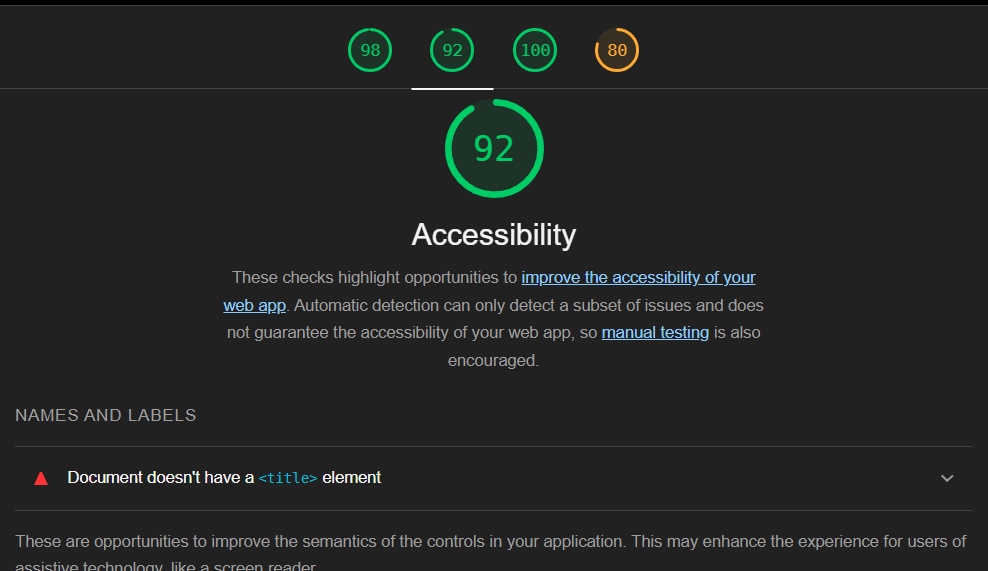

## 1. Preparació.

#### 1.1. Accions Bàsiques.

- Afegiment de Productes
- Edició i Eliminació dels seus productes
- Afegiment, edició i eliminació de ressenyes
- Veure productes i ressenyes d'altres usuaris
- Filtrar els productes

#### 1.2. Verificació Accessibilitat.

Podem veure com, en aquest cas, ens faltaría incloure un <title> a la pàgina. En aquest cas, no hi tenim gaires falles ja que tenim una alta puntuació

## 2. Realització de Proves amb Usuaris.

A continuació, diferents punts que ens hem trobat durant la realització del programa amb el suport de diferents persones com ara la meva germana, la meva mare o el meu pare que m'han fet el favor:

#### 2.1. Observacions.

##### De part de un usuari avançat (la meva germana):

- Ens varem trobar amb diferents botons que no resaltaven el text tant com haurien (combinació de groc i blanc)
- Algunes caixes o interaccions es veien rares i necessitaven de transicions per donar un efecte mes "smooth".
- Algunes distribucions dels objectes que es mostren per pantalla (per ex, com mostrar els gèneres alhora de crear productes, que ha set millorada).

##### De part d'usuaris poc avançats (la meva mare i el meu pare):

- El llenguatge els ha tirat bastant enrere (la pàgina nomes esta en anglès actualment)
- No semblaven del tot còmodes amb els icones de l'aplicació (per ex, el núbol utilitzat per la pujada de productes)
- Potser hagues set bona ideia aclarir els requisits abans de temps alhora de crear un usuari nou (també en part a l'idioma els hi ha costat identificar que feien malament)

## 3. Anàlisis i Propostes de Millores.

Parlant a un nivell mes tècnic, potser faltaría una mica d'Error Handling a l'aplicació, per exemple, de mostrar potser amb una mica mes de detall o mes clarament el que esta fallant
exactament.

D'altra banda, potser es millorable la interfície amb Icones. He descobert que, encara que per un usuari avançat sigui relativament senzill moure's per l'aplicació, un usuari no tan avançat no sempre
interpreta coses com "un núbol pot pujar coses" o "la fletxeta et revela coses com filtres".

Llavors, principalment, crec que l'aspecte de la navegació es millorable de cara a usuaris amb poca experiència.
